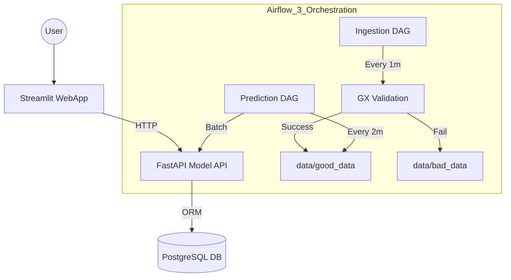

# Cloud Outage Prediction System

This is our end-to-end Machine Learning production system. We built it to predict **how long a cloud outage will last (in hours)** based on incident data like severity, system load, and affected customers. This project was developed for **Defense 1** of the Data Science in Production course.

---

## Architecture Overview

The system is fully containerized and consists of four main layers:

1.  **User Interface:** A Streamlit WebApp for manual predictions and viewing historical data.
2.  **Serving Layer:** A FastAPI Model API that loads our Random Forest model and saves every prediction to PostgreSQL via SQLAlchemy.
3.  **Data Orchestration:** Apache Airflow 3 pipelines that handle automated ingestion and scheduled predictions.
4.  **Data Quality:** Great Expectations (GX v1.x) integrated into the pipeline to stop bad data before it hits the model.



---

## Project Structure

*   `airflow/`: Docker configuration and initialization for Airflow 3.
*   `dags/`: Our automated workflows (`ingestion_dag.py` & `prediction_dag.py`).
*   `data/`: Data storage ($raw, good, bad, archived$).
*   `gx/`: Great Expectations v1.x config.
*   `model_service/`: FastAPI backend and ML logic.
*   `webapp/`: Streamlit frontend code.
*   `tests/`: 22 automated unit tests to ensure pipeline reliability.
*   `.github/`: CI/CD workflow (Linting + Testing).

---

## Quick Setup & Demo Guide

### 1. Prerequisites
Make sure you have **Docker Desktop** installed and running.

### 2. Environment Configuration
Copy the template and generate your secret keys:
```bash
cp .env.example .env
```
> **Tip:** Open `.env` and fill in the `AIRFLOW_FERNET_KEY` and `AIRFLOW_SECRET_KEY` using the generation commands provided in the file comments.

### 3. Prepare the Demo Data
To show the pipeline in action during a live demo, we use a splitting script to simulate a continuous stream of data:
```bash
# Split the main dataset into 30 small files inside /data/raw_data
python split_dataset.py --input data/cloud_outages_dataset.csv --output data/raw_data --num-files 30

# (Optional) Inject errors to test the Great Expectations validation
python generate_data_issues.py --input data/cloud_outages_dataset.csv --output data/raw_data/corrupted.csv --probability 0.4
```

### 4. Launch the System
```bash
docker compose up --build -d
```

---

## Service Dashboard

Once the containers are healthy, you can access everything here:

| Service | Address | Login (if req.) |
| :--- | :--- | :--- |
| **Streamlit Webapp** | [http://localhost:8501](http://localhost:8501) | — |
| **Airflow 3 UI** | [http://localhost:8080](http://localhost:8080) | `admin` / `admin` |
| **FastAPI Docs** | [http://localhost:8000/docs](http://localhost:8000/docs) | — |
| **GX Data Docs** | [http://localhost:8090](http://localhost:8090) | — |

---

## Team & Responsibilities

We divided the work according to specialized domains to ensure the highest code quality:

*   **Member 1:** (Me) - Infrastructure, Docker Orchestration, Airflow 3 Migration, and CI/CD setup.
*   **Member 2:** FastAPI Backend Developer & Great Expectations Validation lead.
*   **Member 3:** Frontend Specialist (Streamlit) and UI/API Integration.
*   **Member 4:** Data Engineer (Split & Error scripts) and Quality Assurance (Pytest).

---

## Model Performance & Thresholds

*   **Model:** Random Forest Regressor (Sklearn)
*   **Target:** Incident duration in **Hours**.
*   **Anomaly Detection:** Any outage predicted to last **> 5 hours** is flagged as a critical anomaly.
*   **Cold Start:** The API automatically trains a model on startup if `model.pkl` is missing.

---

## CI/CD and Git Workflow

We use a professional **Feature Branch** workflow:
1.  Develop on `feature/*` branches.
2.  Push to trigger **GitHub Actions** (checks syntax with Flake8 and runs 22 tests).
3.  Merge to `main` via **Pull Requests** only after tests pass.
